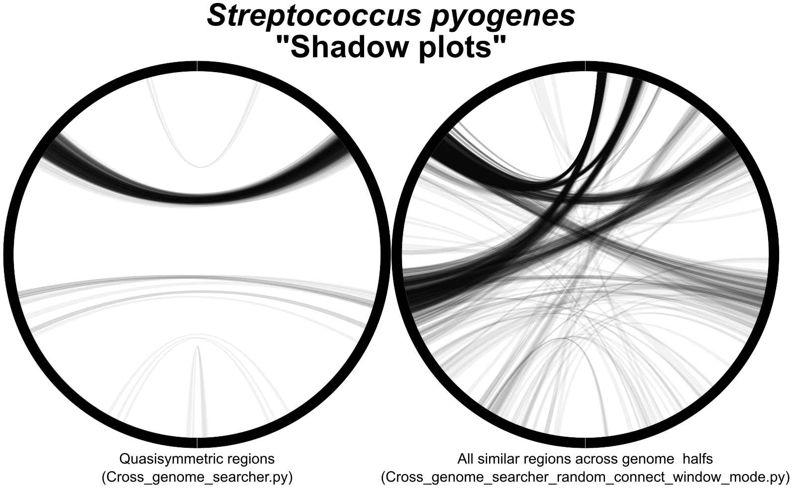

# Cross replicore similarities
These scripts can be used to identify regions of increased similarity that are either quasisymmetrically (Cross_genome_searcher.py) or dispursed through out the genome (Cross_genome_searcher_random_connect_window_mode.py). To python scripts are provided, one for either analysis.
Python>=3.9 is required along with installation of [cd-hit](https://github.com/weizhongli/cdhit), [seqkit](https://github.com/shenwei356/seqkit), and [Circlator](https://github.com/sanger-pathogens/circlator).

The R script provided (Shadow_plot_script.R) outlines how to create the shadow plot (see figure 1)

<!--- Add in image and caption --->

Figure 1: Shadow plot for for 249 complete <i>Streptococcus pyogenes</i> genomes. Left is the shadow plot for quasisymmetrically placed regions. Right is the shadow plot for regions dispursed thorughout the genome with connection between reigon from opposing halfs of the genome. Produced using Shadow_plot_script.R and the python script given beneth each shadow plot. 

<!--- _______________________ --->

An example of an aoutput file used to produce the left shadown plot of figure 1 is given (Streptococcus_pyogenes_relative_genome_connections_example.tsv).